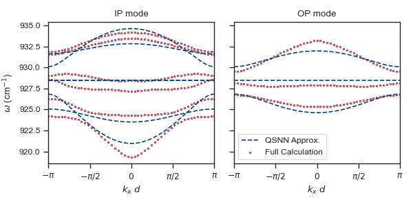
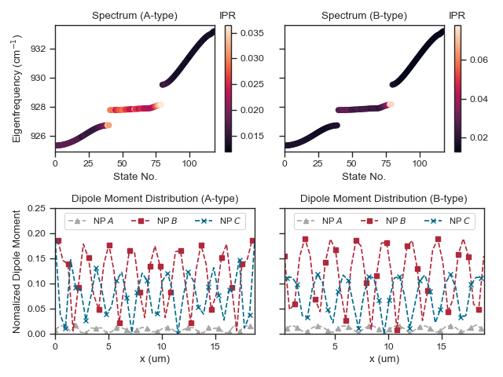
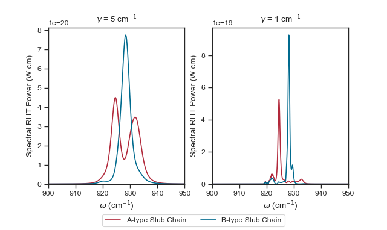
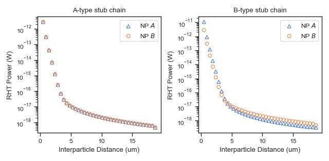
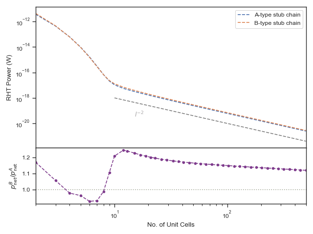

# Tailoring radiative heat transfer in quasi-1D flat-band stub lattices composed of plasmonic nanoparticles

## Environments & Packages

- Python
- Matplotlib
- SciPy
- h5py
- NumPy
- Seaborn

## Data collections

## Figures
### FIG. 1: Band structure of the stub lattice under periodic boundary condition

### FIG. 2: Eigenstates and states in the upper/middle/lower band in OP mode under open boundary conditions

(a) The band structure under OBCs.
.png)

(b-d) Dipole moment distribution of the states in upper, middle and lower bands in OP mode.
.png)

### FIG. 3: Band structures and dipole moment distributions of the A/B type stub chain

### FIG. 4: Spectral RHT between left- and right-end NPs.

### FIG. 5: RHT between the left-end NP and the remaining NPs

### FIG. 6: RHT power between two ends of the A/B-type stub chain with respect to the chain length under

### FIG. 7
